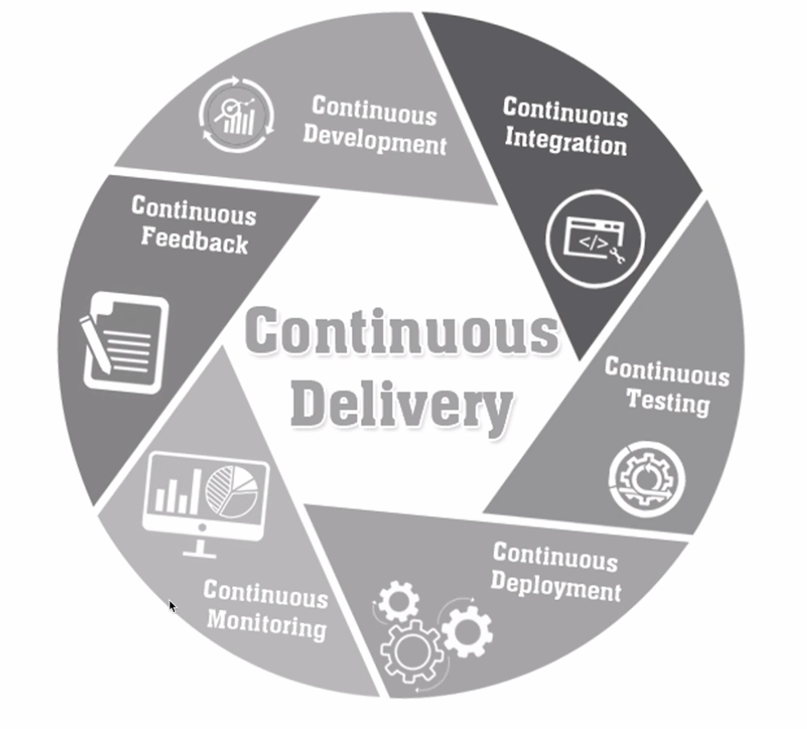

# Spring cloud microservice

* Spring boot 를 활용해서 
  * 웹 어플리케이션과 REST API 를 개발
  * 해당 어플리케이션을 서비스하고 운영하기 위해 클라우드 네이티브 기술을 어떻게 활용할것인지 학습한다.
* 톺아보기
  1. 스프링 클라우드 기본적인 기능 
  2. 클라우드 네이티브와 마이크로 서비스의 특징
  3. 스프링 부트와 스프링 클라우드 프레임워크를 활용하여 MSA 를 개발하는 방법
  4. 클라우드 인프라에서 운영하기 위해 필요한 핵심적인 개념
     * 이러한 서비스로 마이크로서비스를 배포하고 운영하는 방법

* Part 1
  1. Microservice 와 Spring Cloud 소개
  2. Service Discovery
  3. API Gateway Service
  4. E-commerce 애플리케이션
  5. User Microservice 1
  6. Catalogs, Order Microservice 
  7. User Microservice 2
  8. Configuration Service
  9. Spring Cloud Bus
* Part 2
  10. 암호화 처리를 위한 Encryption 과 Decryption
  11. 마이크로서비스간 통신
  12. 데이터 동기화를 위한 Kafka 활용 1
  13. 데이터 동기화를 위한 Kafka 활용 2
  14. 장애 처리와 Microservice 분산 추적
  15. 애플리케이션 베포를 위한 컨테이너 가상화
  16. 애플리케이션 배포 - Docker Container
  17. Microservice 패턴

* 문서 목차
  * [Software architecture](#software-architecture)
  * [Cloud Native Architecture](#cloud-native-architecture)
  * [Cloud Native Application](#cloud-native-application)
  * [12 Factors](#12-factors)
  * [Monolithic vs MSA](#monolithic-vs-msa)
  * [Microservice](#Microservice)
  * [SOA(Service Oriented Architecture) 와 MSA(Micro Service Architecture) 의 차이점](#soaservice-oriented-architecture-와-msamicro-service-architecture-의-차이점)
  * [Microservice Architecture Structures](#microservice-architecture-structures)
  * [Spring Cloud](#spring-cloud)

# Microservice 와 Spring Cloud
## Software architecture
* history of IT system
  * 1960~1980; 하드웨어 중심 개발
    * Fragile, Cowboys
    * Mainframe, Hardware
  * 1990~2000; 분산 시스템
    * robust distribute : 시스템이 안정화되었고, 분산화된 시스템 덕분에 서비스에 어느정도 불확실성이 발생하더라도 안정성있고 성능높은 서비스를 유지할 수 있게 되었다.
  * 2010~; 탄력적 시스템
    * resilient(탄력적)
    * 확장성과 안정성이 더욱 강화되었으며
    * 지속적인 개선 및 변경사항이 생기더라도 시스템은 탄력적으로 운영할 수 있도록 구축되었다
  * 현재; anti fragile
    * DevOps 라는 IT 문화가 생김
    * Architecture 측면에서는 Cloud Native Architecture 로 전환되던 시기
    * 


* anti fragile 특징
  1. auto scaling
     * 자동 확장성을 갖는다는 특징
     * Auto Scaling Group
       * Minimum size(최소 인스턴스) 지정 가능
       * 사용량에 따라 Scale out as needed(원하는 만큼 스케일 아웃) 할 수 있음
     * 예시) 온라인 쇼핑몰
       * 5월, 12월과 같이 특수 이벤트가 있는 달에는 서버의 운영 갯수를 늘리고
       * 비수기와 같은 때는 서버의 운영 개수를 줄이는 작업
     * 관리자, 운영자에 의해 수작업으로 처리되는 것이 아닌 
     * 네트워크, 데이터베이스의 사용량이나 조건에 따라서 자동으로 처리할 수 있는 개념
     
  2. Microservices
     * 넷플릭스와 아마존은 클라우드 서비스를 가장 잘 구축하고 활용하고 있는 대표적 사례
     * 마이크로서비스라는 것은 클라우드 네이티브 아키텍쳐, 클라우드 네이티브 어플리케이션의 핵심
     * 기존 시스템들이 하나의 거대한 형태로 구축되어서 서비스되었다고 하면,
     * 마이크로서비스는 서비스를 구축하고 있는 개별적인 모듈이나 기능을 독립적으로 개발하고 배포하고 운영할 수 있도록 세분화된 서비스라고 볼 수 있다
     
  3. Chaos Engineering
     * 시스템이 급격하게 변화하고 예측하지 못한 상황이라도 견딜 수 있고 신뢰성을 쌓기 위해  
     * 운영중인 소프트웨어 시스템에 실험하는 방법이라던가 규칙이라고 이해할 수 있다
     * 시스템의 어떤 변동, 예견된 불확실성, 예견되지 않는 불확실성, 카오스 불확실성에 대해서 안정적인 서비스를 제공할 수 있도록 구축되어야 한다는 것을 의미한다
     
  4. CI-CD(Continuous deployment)
      * 배포 파이프라인
      * 지속적인 통합, 지속적인 배포라는 의미
      * 클라우드 네이티브 어플리케이션은 적게는 수십게, 많게는 수백개 이상의 마이크로서비스로 분리되어 개발되는 경우가 일반적이다.
      * 하나의 어플리캐이션을 구성하는 수백개의 서비스를 일일이 빌드하고 테스트하고 서버에 배포하는 작업을 수작업으로 한다고 가정해본다면,
      * 시스템 자체의 복잡성을 떠나서 어플리케이션을 구성하고 있는 각각의 서비스를 빌드하고 배포하는 작업이 하나의 커다란 업무이자 작업의 로드가 심하게 걸리는 부분이 되어버릴 수 있다.
      * 그래서 이러한 수십 수백개의 마이크로 서비스를 빌드하고 배포함에 있어서 자동화된 시스템을 구축하고 하나의 작업에서 다른 작업으로 연계되는 과정을 파이프라인으로 연결시켜 놓게 되면 작은 변화 뿐 아니라 전체적인 시스템의 업그레이드 작업에서도 빠르게 적용할 수 있게 된다.
     
## Cloud Native Architecture
* 확장 가능한 아키텍쳐
  * 시스템의 수평적 확장(scale-out; 같은 사양의 인스턴스 양을 늘림)에 유연
  * 확장된 서버로 시스템의 부하 분산, 가용성 보장
  * 시스템 또는, 서비스 애플리케이션 단위의 패키지(컨테이너 기반 패키지)
  * 모니터링
* 탄력적 아키텍쳐
  * 서비스 생성-통합-배포(CI-CD), 비즈니스 환경 변화에 대응 시간 단축
  * 분할 된 서비스 구조
    * 전체 어플리케이션을 구성하고 있는 도메인의 특성에 따라 서비스의 경계를 잘 구분하고 거기에 맞게 서비스를 개발해야 한다.
  * 무상태 통신 프로토콜
    * 서로 분리된 서비스들 간에 원활한 통신을 위해 각각의 서비스들은 종속성을 최소화 시켜야 되고
    * 상태를 갖지 않는 서비스를 제공하려고 노력해야 한다.
  * 서비스의 추가와 삭제 자동으로 감지
    * 전체 어플리케이션을 구축하는 마이크로서비스들은 자신들이 배포될 때 자신들의 위치가 어디에 있는지 등록해야 한다.
    * 그래야 다른 서비스들이나 외부에 연결되어 있는 타 시스템에서도 해당 서비스를 검색하고 사용할 수 있게 된다.
    * 이렇게 마이크로서비스들의 존재는 Discovery Service 라는 곳에 등록되고 삭제되는 작업을 하게 된다.
  * 변경된 서비스 요청에 따라 사용자 요청 처리(동적 처리)
* 장애 격리(Fault isolation)
  * 특정 서비스에 오류가 발생해도 다른 서비스에 영향을 주지 않음
    * 여러개 분리되어 개발되고 있는 마이크로 서비스들은 하나의 독립적인 작은 단위의 어플리케이션과 같다
    * 따라서 하나의 마이크로서비스에 생기는 문제점이나 오류사항은 다른 쪽 서비스로의 영향을 최소화할 수 있게 된다.
    * 어떤 특징적인 부분에 대해서 수정을 한다 하더라도 
    * 전체 서비스를 다시 배포해야 하는 것이 아닌 특정 서비스만 배포할 수 있기 때문에 다른 시스템에 영향을 주지 않을 수 있게 된다.
## Cloud Native Application
* Cloud Native Architecture 에 의해 설계되고 구현되는 어플리케이션을 Cloud Native Application 이라고 한다
* 클라우드 네이티브 어플리케이션은 클라우드 네이티브 아키텍쳐의 특징이나 anti fragile 과 같은 특징을 갖고 다음과 같은 형태로 구현된다

1. Microservices 로 개발
2. CI-CD 로 통합
   * CI-CD 는 지속적인 통합과 지속적인 배포
   * 통합 서버, 소스 관리(SCM), 빌드 도구, 테스트 도구
   * 지속적 통합(CI)
     * 하나의 어플리케이션을 여러 팀이나 여러 개발자를 위해서 함께 개발하고 있는 경우에 결과물을 통합하기 위한 형상관리를 뜻한다.
     * Jenkins, TeamCI, TravisCI
   * 지속적 배포(CD - Continuous Deployment, Continuous Delivery)
     * 소스 관리 툴에 업로드된 코드를 가져와서 패키지화 된 형태의 결과물을 실행 환경에 어떻게 배포하는지 따라서 달라질 수 있다.
     * Continuous Delivery
       * 지속적 전달
       * 수작업
     * Continuous Deployment
       * 지속적 배포
       * 자동작업 
     * 실행 환경에서 서비스 배포시 무작정 기존 코드를 버리고 새로운 코드를 올리지는 않는다
       * 가장 중요한 것은 시스템의 정상적인 운영이고, 그 다음으로는 시스템의 다운타임을 최소화하는 것
       * 변경된 시스템을 부조건 새로 반영한다기 보다는 기존 시스템과 같이 운영해줌으로써 사용자에게 발생할 수 있는 이질감이라든가 문제점들을 최소화 하는것이 필요하다
     * 카나리 배포와 블루그린 배포
       * 시스템에 완성된 결과물을 배포하기 위해서 카나리 배포 또는 블루그린 배포와 같은 전략을 선택할 수 있다 
       * 카나리 배포; 전체 사용자의 95% 는 이전 버전의 서비스를 계속 사용하도록 하고 5% 의 사용자만이 새 버전으로 점진적으로 이전시키는 방법
       * 블루그린 배포; 이전 버전(블루)의 사용자 트래픽을 이전버전과 거의 동일한 새 버전(그린) 으로 점진적으로 이전시키는 방법
3. DevOps 를 통해 Microservices 에 문제가 생겼을 경우 바로바로 수정해서 다시 배포


   * Development 와 Operation (개발, 운영) 이 합쳐진 용어
   * 개발조직과 운영조직의 통합을 의미
   * 이러한 통합으로 고객의 요구사항을 빠르게 반영하고 만족도 높은 결과를 제시하는 것에 그 목적이 있다
   * 기존의 엔터프라이즈 어플리케이션 개발과정
     * 고객의 요구사항에 맞게 도메인을 분석
     * 시스템을 설계
     * 어플리케이션 구현
     * 테스트
     * 배포
     * 이러한 과정은 적게는 3 ~ 6 혹은 10개월, 1년이상의 과정을 거쳐 진행되기도 한다.
   * 개발 기간이 길어진다는 것은 그만큼 변경사항, 요구사항에 바로 대처하기 어렵다는 단점이 있다.
   * 고객의 요구사항은 언제든 변경될 수 있다.
     * 이러한 변경사항, 오류사항 또는 개선사항 같은 것들은 시스템의 개발 막바지, 종반에 발생하는 것보다는 
     * 필요할 때 마다 바로 반영이 되고 필요할 때마다 바로바로 수정할 수 있는 구조가 더 좋다.
     * 물론 그때그때 고객의 요구사항을 반영하고 개발된 내용을 테스트를 자주자주 하는것 자체는 전체 개발의 일정을 더디게 하는 요인이 될 수 있다
     * 하지만 개발 회사가 개발하려고 하는 서비스라든가 어플리케이션은 궁극적으로 고객의 요구사항에 맞는 에러 없는 완성물이어야 한다
     * 따라서 자주 테스트하고 자주 피드백을 받고 자주 업데이트하는 과정을 거쳐 전체 개발 일정이 완료될 때 까지 지속적으로 끊임없이 진행해 가는 것을 DevOps 라고 볼 수 있다
4. 하나의 application 을 구성하는 Microservices 들을 클라우드환경에 배포하고 사용하기 위해서는 Container 가상화 기술을 사용하게 된다.
* 가상화는 클라우드 네이티브 아키텍처의 핵심
  * 컨테이너 가상화 기술
    * 기존에 로컬 환경에서 운영하고 유지해야만 했던 시스템
    * 클라우드 환경으로 이전해 적은 비용으로 탄력성 있는 시스템을 구축
    * 기존의 하드웨어 가상화 또는 서버 가상화에 비해서 적은 리소스를 사용하여 가상화 서비스를 구축할 수 있습니다
  * 전통적인 방식의 개발 시스템 vs 가상화를 통한 개발 시스템 vs 컨테이너 가상화 기술
    * 전통방식
      * 하드웨어 시스템 위에 운영체제를 설치, 그 다음 어플리케이션들을 운영하게 됨
    * 가상화
      * 운영체제 위에 Hypervisor 기술을 통한 가상 머신을 기동하게 된다
      * 그리고 이러한 가상 머신은 시스템이 가지고 있는 물리적인 하드웨어, 호스트 시스템이라고 하는데 호스트 시스템이 가지고 있는 물리적인 하드웨어를 쪼개서 사용하는 개념으로서 하나의 가상머신은 독립적인 운영체제를 가지고 실행될 수 있다
      * 그러나 가상 머신에서 작동되는 어플리케이션은 호스트 운영체제에 많은 부하를 주게 되고 시스템 확장에 한계가 있을 수 밖에 없다.
    * 컨테이너 가상화
      * 운영체제 위에 컨테이너 가상화를 기동하기 위한 소프트웨어 서비스(Container Engine, Container Runtime...)를 작동하게 되고
      * 컨테이너 가상화에서는 공통적인 라이브러리나 리소스 같은 것들을 공유해서 사용하게 된다.
      * 각자 필요한 부분에 대해서만 독립적인 영역에다가 실행할 수 있는 구조

## 12 Factors
* [https://12factor.net/](https://12factor.net/)
* 클라우드 네이티브 어플리케이션을 구축함에 있어 고려해야 할 12가지 항목
  * 12 factors 는 클라우드 서비스 중 Azure Service 를 PaaS 로서 제공하는 Heroku 라는 개발 회사에서 제시한 12가지 항목
  * 클라우드 네이티브 어플리케이션을 개발하거나 서비스를 운영할 때 고려해야 할 항목을 정리한 것
  * Heroku 라는 회사에서는 자사의 고객들을 상대로 클라우드 서비스 시에 발생했었던 문제점과, 개선점, 시행착오 등을 바탕으로 이러한 가이드라인을 만들어서 배포함
  * 많은 클라우드 네이티브 어플리케이션에서 이러한 가이드를 바탕아로 어플리케이션을 설계하고 개발하고 운영하는데 사용하고 있다
* 12 factors 에는 
  * 코드 통합(BASE CODE)
    * 자체 레퍼지토리에 저장된 각 마이크로서비스에 대한 단일 코드베이스를 뜻함
    * 버전을 제어하기 위한 목적이고, 형상 관리를 위해서 코드를 한 곳에서 배포하는게 주 목적
  * 종속성의 배제(DEPENDENCY ISOLATION)
    * 각 마이크로서비스는 자체 종속성을 가지고 패키지가 되어 있어서
    * 전체 시스템에 영향을 주지 않은 상태에서 변경되고 내용을 수정할 수 있어야 한다
  * 환경 설정의 외부 관리(CONFIGURATION)
    * 구성정보, 코드 외부에서 코드 안에 하드코드되어 있는 어떤 구성 설정 정보가 아니라
    * 시스템 코드 외부에서 구성 관리 도구를 통해서 마이크로 서비스에 필요한 어떤 작업들을 제어하는 것
    * 동일한 배포가 올바른 구성이 적용된 환경에서 전파될 수 있도록
  * 서비스 지원, 보조 서비스(LINKABLE BACKING SERVICES)
    * 보조 서비스를 예를 들어서 데이터베이스라든가 캐시, 메시징 서비스, 브로커 이런 것들을 이용해서 마이크로서비스가 가져야 될 어떤 기능들을 추가로 지원할 수 있는 것
    * 응용 프로그램 자체에서 필요한 백킹 시스템 리소스를 분리하게 됨으로서 서로 상호 가능한 서비스 자체를 우리가 코드 디펜던시를 갖지 않은 상태에서 작업할 수 있게 된다고 보면 된다
  * 빌드와 릴리즈 실행환경을 각각 분리(개발 환경과 테스트 운영 환경의 분리;STAGES OF CREATION)
    * 우리는 필요한 이 상태에 대해서 처음에 개발 서버에서 만들어진 이 코드를 나중에 배포를 하기 위해서 실행 단계까지 옮기는 이 과정을 엄격하게 분리해야 된다
    * 각각은 고유한 아이디로 태그를 가지고 있어야 되고 이전 상태로 돌아가는 롤백 기능을 지원해야 하며,
    * CI/CD 시스템을 완벽하게 이용을 해서 자동화된 시스템을 구축하는게 좋다
  * 프로세스(STATELESS PROCESS)
    * 각각의 마이크로서비스는 실행 중인 다른 서비스와 분리된 채 자체 프로세스에서 운영될 수 있어야 한다
    * 하나의 마이크로서비스는 다른 쪽에 있는 마이크로서비스와 분리되어 독립적으로 실행될수 있는 상태여야 한다
    * 필요한 자원이 있다고 하면 캐시 혹은 데이터 저장소와 같은 형태를 이용해서 외부와 데이터를 교환하여 데이터를 동기화하는 방법 등을 채택해야 한다
  * 포트 바인딩(PORT BINDING)
    * 각각의 마이크로서비스는 자체 포트에서 노출되는 인터페이스 및 기능과 함께 자체에 포함되어 있는 기능이 있어야 한다
    * 이렇게 해야 다른 마이크로 서비스와의 격리가 가능하다
  * 동시성(CONCURRENCY)
    * 마이크로서비스는 사용 가능한 가장 강력한 인스턴스 컴퓨터에서 가장 큰 인스턴스로 확장하는 것과는 반대로 아주 많은 수의 수많은 서비스를 동일한 프로세스를 복사해서 확장을 해 나가게 된다
    * 하나의 서비스가 여러가지 인스턴스에 동일한 형태로 복사가 되서 운영됨으로서 부하 분산을 이뤄낼 수 있다
    * 이렇게 동일한 그 서비스가 여러 pc, 여러 인스턴스를 나눠서 서비스가 되고 있기 때문에, 동시성을 가지고 있어야 된다
  * 서비스 인스턴스 자체의 삭제(DISPOSABILITY)
    * 서비스 인스턴스 자체가 삭제가 가능해야 한다
    * 그리고 확장성 기회를 높여야 하고 정상적으로 종료를 할 수 있는 상태가 되어야 한다
    * 컨테이너 가상화 기술로서 도커, container d, CRI-O 등의 제품을 사용한다고 하면,
    * 서비스의 인스턴스를 등록 실행 삭제 작업을 쉽게 할 수 있게 된다.
  * 개발 단계와 프로덕션 단계를 구분(DEVELOPMENT & PRODUCTION PARITY)
    * 운영 프로그램의 수명 주기 전반에 걸쳐서 최대한으로 바로 서비스를 직접 액세스하는 기능을 방지해서
    * 환경 자체를 최대한 다른 쪽에 있는 작업과 중복되지 않고 다른 쪽의 작업과 종속적이지 않은 상태로서 서비스를 유지할 수 있어야 된다
  * 로깅 시스템(LOGS)
    * 로깅 시스템이라는 것은 마이크로 서비스에 의해서 생성된 어떤 로그를 이벤트 스트림으로 처리해야 한다
    * 즉 하나의 시스템 안에서 구성되고 있는 로그를 출력하는 로직은 기존에 있었던 어플리케이션 로직과 분리가 되서 어플리케이션 자체가 실행되지 않는 상태라 하더라도 로그만은 정상적으로 작동할 수 있는 상태여야 한다
    * 이러한 로그 또는 이벤트 집계를 사용하기 위해서는 별도의 추가적인 서비스 아니면 모니터링 도구를 사용할 수 도 있다
    * 예시로 Azure 모니터링, 스플렁크 데이터 마이닝, 로그 관리 tool ELK.. 등을 활용해 장기적으로 보관되어 있는 로그를 분석하는 용도로도 사용할 수 있다
  * 관리 프로세스(ADMIN PROCESS FOR EVENTUAL PROCESSES)
    * 현재 운영되고 있는 모든 마이크로 서비스들을 어떤 상태로 사용하고 있으며 리소스가 어떻게 현재 쓰고 있는지에 대해 파악하기 위한 적절한 관리 도구가 있어야 한다
    * 이러한 작업에는 리포팅할 수 있는 기술이 포함되어 있어야 한다
    * 데이터 정리 및 데이터를 분석하는 기능이 포함될 수 있다
* 추가 +3 factors
  * API First
    * 마이크로서비스는 API 형태로 한 서비스가 제공이 되는데, 이를 구축함에 있어서 사용자 측에서 어떤 형태로 쓸 것인가를 먼저 고민해서 개발해야 한다
  * Telemetry
    * 관리 프로세스와 유사
    * 모든 지표를 우리가 수치화, 시각화하여 관리할 수 있어야 한다
  * Autnetication and Authorization
    * 인증 작업
    * 마이크로서비스 간에 분리되어 있는 형태로 개발이 된다 하더라도 
    * 우리가 구현하고 있는 마이크로서비스는 적절한 인증을 가지고 있는 리소스, 인증을 가지고 있는 서비스, 인증을 갖고 있는 외부 시스템에서는 데이터를 전달하고 교환하는 작업이 가능해져야 한다

## Monolithic vs MSA
* Monolith
  * 모노리스 방식은 애플리케이션을 개발함에 있어서 필요한 모든 요소를 하나의 커다란 소프트웨어 안에서 전부 포함시켜 개발하는 방법
  * 데이터베이스 관련 로직 혹은 비즈니스 로직 뿐 아니라 화면을 처리하는 프론트엔드 기술까지 이 모든 서비스의 내용들이 하나의 어플리케이션에서 유기적으로 연결되어 작동하고 있고 배포되기 위해서 서로 의존성을 가진 채 패키징되고 운영 서비스에 배포하게 된다
  * 모든 업무 로직이 하나의 애플리케이션 형태로 패키지 되어 서비스
  * 애플리케이션에서 사용하는 데이터가 한 곳에 모여 참조되는 서비스되는 형태
  * 모노리스의 방식의 문제점은 하나의 시스템에 어플리케이션을 구성하고 있는 모든 서비스와 요소들을 패키징하여 서비스가 되어야 하기 때문에 시스템의 일부를 수정한다 하더라도 전체 어플리케이션을 다시 빌드하고 테스트하고 패키징해야 한다는 단점을 갖고 있다
  * 예시
    * Calcuation 서비스의 어떤 로직 퍼센트 수치가 변경되는데, 전혀 관계없는 전체 카피 기능과 전체 TODO 기능 등.. 어플리케이션 내 모든 로직들이 다시 패키징되고 배포되는 과정을 거챠야 한다

* MSA(Micro Service Architecture)
  * 어플리케이션을 구성하는 각각의 구성 요소 및 서비스의 내용을 분리해서 개발하고 운영하는 방식
  * 하나의 큰 덩어리에서 개발되어지는 모노리스 방식에 비해서 유지보수나 변경사항을 적용하는 데 훨씬 유리하다
  * 비즈니스 로직의 어떤 서비스의 프로세스가 변경이 되어서 새로 개발이되어야 한다고 가정했을 때, 필요한 부분에 대해서만 개발을 하고 이렇게 분리된 서비스가 다른 서비스에 영향을 주지 않거나 최소화하면서 독립적으로 배포가 가능하게 된다
  * 따라서 어플리케이션 전체가 다운타임이 되는 현상을 없앨 수 있게 된다
  * Building Microservices(Sam Newman)
    * Small autonomous services that work together
      * 마이크로 서비스; 함께 작동하는 작은 규모의 서비스들
    * In short, the microservice architectural style is an approach to developing a **single application** as a suite of **small services**, each running in its own process and communicating with lightweight mechanisms, on an HTTP resource API...contd
      * 마이크로 서비스 아키텍처 스타일 자체가 HTTP 통신을 이용해서 리소스 API 에 통신할 수 있는 작은 규모의 여러 서비스들의 묶음이 모여서 하나의 어플리케이션을 구성한다
      * 전체 어플리케이션을 구성할 때 한 덩어리가 아니라 잘게 쪼개진 여러 덩어리를 가지고 개발한다는 의미
    * These services are built around **business capabilities** and **independently deployable** by fully **automated deployment** machinery…contd
      * 이런 서비스들은 비즈니스 기능을 중심으로 구축되어야 한다
      * 완전하게 자동화된 배포 시스템을 사용해야 한다(CI, CD)
  * 마이크로 서비스들이 가져야할 특징(Martin fouler)
    * There is a bare minimum of **centralized management** of these services, which may be written in **different programming languages** and use **different data storage** technologies
      * 각각의 서비스들은 최소한의 중앙 집중식 관리가 되어야 한다
      * 서로 다른 프로그래밍 언어와 서로 다른 데이터 저장 기술을 사용할 수 있다
        * 기존 모노리스, 마이크로 서비스의 개발 방식의 가장 큰 차이점은 하나의 서비스를 구성하고 있는 크기이다
        * 서비스의 크기가 도메인의 특성을 고려해서 경계를 구분해야 하고, 구분된 서비스들은 독립적인 언어와 독립적인 데이터베이스를 사용할 수 있다
        * 예시
          * 어떤 회사에서 엔터프라이즈 어플리케이션을 개발할 때는 먼저 고객의 의뢰를 받는다
          * 고객 프로젝트 에러를 검토하고 승인을 내린다
          * 개발 조직의 구성을 하고 요구사항을 수립하고 업무 도메인 정리와 분석, 시스템 설계 이런 과정으로 진행이 된다
          * 설계가 완료되어 개발이 시작되어야 되는 시점에 어떤 언어를 사용할 것인지 어떤 데이터베이스를 사용할 것인지 프로그래밍 언어를 위한 네이밍 룰이라던가 인터페이스 등을 결정하고 진행하게 된다.
          * 마이크로서비스에서는 이러한 프로그래밍을 개발 언어와 데이터베이스를 전체 어플리케이션에서 통일하는 것이 아니라 각각의 서비스별로 특색에 맞게 최적화되어있는 언어와 데이터베이스를 사용하는 것을 권장하고 있다
          * 프로그래밍 언어;C, C++, Java, Python, Node.js, Visual, C# 등..
          * 관계형 데이터베이스;Oracle, MSSQL, MySQL, MariaDB, 
          * NoSQL; Cassandra, MongoDB...
          * 서버사이드 개발(Java), 하드웨어(C, C++), 데이터분석과 머신러닝(Python), 서버사이드의 JavaScript 와 비동기 서비스(Node.js) .. 각각 기능에 맞춰서 최적화되어 있는 퍼포먼스를 발휘할 수 있다
        * 어떤 어플리케이션을 개발함에 있어서 이런 언어와 데이터베이스를 통일해서 사용할 필요가 있을까?
          * 서비스의 종류와 기능에 맞춰서 개발언어를 선택하고 각각의 서비스들은 자신이 제공해야 하는 서비스나 데이터를 API 를 통해서 제어할수 있게 하면 된다
          * 굳이 통일된 언어를 사용할 필요가 없다는 이야기이다
          * 더욱이 요즈음 처럼 다양한 스마트 디바이스들이 클라이언트로서 사용된다고 하면 더이상 웹브라우저에서 제공되는 형태로 프론트엔드 기수을 정할 필요도 없고 거기에 따라서 제약을 가지고 있는 상태에서 개발할 필요가 없다
        * 이렇게 마이크로서비스는 어플리케이션을 구성하는 다양한 서비스의 경계를 잘 분리하고 각 서비스의 상황과 기능에 맞춰 개발언어를 선택하고 각각의 서비스들은 RESTful API 같은 메커니즘을 통해서 서로의 데이터를 제공해서 사용할 수 있도록 개발을 하게 된다
* Monolith vs Front & Back vs MSA
  * Front & Back
    * 모노리스 방식과 마이크로서비스 방식의 중간 정도의 개발 방식
    * 프론트엔드와 백엔드를 분리해서 개발
    * 하나의 어플리케이션의 모든 로직과 서비스가 포함되는 모노리스 방식보다는 사용자에게 화면을 보여주고 어떤 액션을 처리받도록 하기 위한 프론트엔드 부분과 백엔드 또는 서버사이드를 분리해서 개발하는 방식
    * 프론트엔드를 개발하는 팀과 백엔드를 개발하는 팀, 개발하는 조직이 나뉘어져 있다
    * 모바일 어플리케이션 방식에서 많이 볼 수 있는 Architecture
      * 안드로이드 개발언어 Java, 코틀린
      * 아이폰에서는 ObjectiveC, Swift 를 이용해서 어플리케이션을 개발
      * 그리고 서버사이드와 통신을 위해 HTTP 라든가 고유의 프로토콜을 이용해서 통신하게 된다
      * 이렇듯 서버와 클라이언트를 분리해서 개발하게 되면 서로에게 필요한 통신만 분리하게 되고 서로에게 필요한 통신만 맞게 된다면 각각 최적화되어 있는 개발 환경을 독립적으로 유지하는 게 가능하게 된다
      * 또한 사용자에게 보여지는 앱의 인터페이스라던가 화면을 변경할 경우는 백엔드 서버 자체를 같이 포함해서 빌드할 필요가 없어지게 된다
      * 기존에 자바라든가 파이썬이라던가 이런 부분을 작업하게 되면 우리가 화면을 변경한다 하더라도 전체를 같이 다시 패키징해서 배포하는 과정이 있었기에 이런 아키텍쳐가 탄생함
  * MSA
    * Monolith 에서 Front 를 Back 과 구분한것과 마찬가지로 Backend 의 각 서비스를 서로 의미 잇는 경계로 구분하는 아키텍처
    * 하나의 커다란 백엔드가 아니라 프로젝트 서비스, 바스켓 서비스, 페이먼츠 서비스 등 각각 서비스가 독립적으로 구분되고
    * 비즈니스 로직과 데이터베이스 관련 로직을 구분하고 있고
    * 데이터베이스 부분도 하나의 통일된 데이터베이스를 사용하는게 아니라 독립적인 서비스에 맞게 분리되고 사용되고 있는 서비스방식을 취하고 있다

* Monolith vs MSA
  * Monolith
    * 화면을 나타내는 UI, 웹 서비스, 비즈니스 로직, 데이터베이스 로직을 하나의 구성요소로 보고 있고 시스템의 데이터베이스를 포함해서 같이 구성을 하게 된다
  * Microservice
    * 비교적 복잡해 보임
    * 최근 어떤 어플리케이션을 개발한다 하더라도 스마트 디바이스를 고려하지 않을 수 없다
    * 기존에는 윈도우 운영체제에서 구동되는 윈도우 앱만 고려를 했던 시기였다면, 최근은 스마트 디바이스의 발달로 다양한 디바이스를 고려하지 않으면 안되는 시기가 되었다
    * 디바이스가 다양하다는 것은 사용자의 요청 정보를 처리하는 서버사이드 기술도 거기에 맞는 다양한 형태로 서비스되어야 한다는 
    * 그러나 모든 디바에스에 맞는 방식을 일일이 개발하거나 테스트하는 것 자체가 무리가 있다
    * 예시
      * 삼성전자의 갤럭시 디바이스의 경우 S, 노트, J 등.. 여러 대응 디바이스가 존재하고 화면 해상도 입력방식도 제각각이다 하면 모두 개발 테스트가 불가능하므로
      * 이러한 변화가 많은 클라이언트의 단말기는 프론트엔드 개발회사한테 맡기고 서버에서는 서비스의 핵심적인 내용, 그리고 그러한 비즈니스 로직을 처리하기 위해 필요한 내용을 통일된 포맷으로 사용 클라이언트 단말기에게 전달하기만 하면 고려 대상이 훨씬 줄어들 수 있다
      * 또한 서버사이드에서 개발해야 하는 각각의 기능들도 각 서비스에 경계에 맞는 형태로 개발되고 테스트되고 배포됨으로써 비록 하나의 어플리케이션을 구성해야 하는 다른 서비스들이라 할 지라도 서로 다른 서비스들과 통일적으로 관리할 수 있게 될 것이다
    * 무엇보다 중요한 것은 이러한 마이크로 서비스들을 관리하기 위한 기술도 같이 발전되어야 한다는 것이다
      * 서비스 요청에 대한 통일된 게이트웨이라던가 각각 서비스들의 등록, 검색, 서비스들의 부하 분산, 서비스 장애시 대처방법, 분리된 서비스들의 데이터를 동기화하기 위한 메커니즘이 필요하게 되었다
    * 단순한 어플리케이션을 개발뿐만 아니라 각 서비스들의 인프라 스트럭쳐와 배포 및 운영 방식에 대해서 같이 알아야 하는 이유이다


## Microservice
* 아마존 vs 넷플릭스 MSA mesh

  * 검정, 초록 점; microservice 단위
  * 점들을 이은 선; 각각의 서비스들간의 호출
* Jeff Bezos`s email
  1. All teams will henceforth expose their data and functionality through service interfaces.
     * 모든 팀은 서비스 인터페이스를 통해서 데이터 기능을 공개해야 한다
  2. Teams must communicate with each other through these interfaces.
     * 팀들은 이런 인터페이스를 통해서만 통신을 해야 된다
  3. There will be no other form of interprocess communication allowed: no direct linking, no direct reads of another team's data store, no shared-memory model, no back-doors whatsoever. The only communication allowed is via service interface calls over the network.
     * 각각의 팀들은 인터페이스가 아닌 방식을 지원하지 않을것이다. 지금 말했던 서비스 인터페이스를 통해서 데이터와 함수 같은 것들을 공개할 것이다
     * 다른 형태의 프로세스 간 통신은 허용하지 않는다
     * 예, 직접 연결, 다른 팀의 데이터 저장소에 대한 직접 읽기, 공유 메모리 모드, 백도어링 등이 있다
       * 데이터베이스에 그동안 우리가 만들었던 어떤 어플리케이션에서 데이터베이스에 접속을 해서 데이터베이스의 자료를 가지고 오거나 저장하고 작업을 해야 하는데, 보통 일반적으로 많이 사용하는 방법은 데이터베이스의 IP 어드레스라던가 호스트 네임, 포트번호, 그리고 아이디 페스워드 입력을 한다
       * 적절한 권한을 가지고 있는 계정을 통해서 접근을 한다
       * 그런데 이러한 직접 접근을 허용하지 않을 거고 반드시 허용되는 유일한 통신 방법은 서비스 인터페이스를 통해서만 접속을 해야 한다
  4. It doesn't matter what technology they use. HTTP, Corba, Pubsub, custom protocols - doesn't matter.
     * 사용하고 있는 기술은 중요하지 않다.
     * 프로그래밍 언어, 프로토콜, 통신방식, 어떤것도 중요하지 않다.
  5. All service interfaces, without exception, must be designed from the ground up to be externalizable. That is to say, the team must plan and design to be able to expose the interface to developers in the outside world. No exceptions.
     * 서비스 인터페이스는 예외없이 모두 처음부터 외부에 공개될 수 있도록 설계되어야 한다
     * 서비스 인터페이스가 있으면 외부에 공개해야 한다
     * 반드시 외부에 공개할 준비를 하고 초기 설계부터 되어야 한다
  6. Anyone who doesn't do this will be fired.
  7. Thank you; have a nice day!

* Microservice 특징
  1. Challenges
  2. Small Well Chosen Deployable Units
     * 독립적으로 배포 가능한 형태의 작은 서비스
  3. Bounded Context
     * 각각의 서비스 어플리케이션을 구성하고 있는 전체 도메인의 지식의 따라 서비스 경계를 잘 구분해야 한다
     * 하나의 서비스가 여러 서비스로 나뉘기도 하고, 여러 서비스가 하나로 통합되기도 한다
  4. RESTful
     * 서로 상태에 대해서 REST api 방식으로 통신하는 것을 권장
  5. Configuration Management
     * 마이크로 서비스들이 가지고 있는 어떤 환경에 대한 정보나 설정에 대한 정보는 코드내에 갖고 있지 않아야 한다.
     * 외부 시스템을 통해 관리하겠다
     * 예; IP 정보
       * 이런 정보들은 하드코딩할 수 밖에 없다.
       * 하지만 이런 정보들이 코드내에 같이 패키징되면 정보가 바뀔 때 마다 매번 재 패키징을하여 배포해야 한다
       * 이런 설정 정보들을 코드가 아닌 외부 설정파일로 관리한다면 매번 코드를 패키징할 필요가 없어지게 된다
  6. Cloud Enabled
     * 클라우드 네이티브 기술을 활용
  7. Dynamic Scale Up And Scale Down
     * 서비스를 제공하는 인스턴스들은 스케일업 스케일 다운 등을 동적으로 처리할 수 있도록 구성해야 한다
     * 마이크로서비스들은 시각화 할 수 있는 관리 도구를 갖고 있어야 한다
     * 이러한 모든 것들은 하나의 서비스가 다른 서비스의 형태를 조작하고 사용함으로서 전체 어플리케이션을 구성할 수 있어야 한다
  8. CI/CD
     * 이러한 서비스들이 여러개가 묶여서 하나의 어플리케이션을 구성하다 보니까 자동화된 배포가 필요하다
  9. Visibility
     * 이러한 서비스들이 여러개가 묶여서 하나의 어플리케이션을 구성하다 보니까 마이크로서비스를 시각화하여 관리할 수 있어야 된다
* ~~Everything should be a microservice~~
  * 기업에서는 기존의 4가지 시스템들을 마이크로 서비스로 전환을 하거나 신규 프로젝트를 무조건 마이크로서비스로 개발해야 할까?
    * 그렇지 않다
    * 마이크로서비스 아키텍쳐 도입을 고려하기 전에 고려할 체크사항
      * Multiple Rates of Change
        * 어느 정도 변화가 생길 것인가?
        * 기존 개발 대비 비용이라던가 시가닝 더 투자되어야 되는 것은 분명하므로,
        * 이런 단점에도 불구하고 도입해야 한다하면 어느 정도의 공수를 고려하고 받아들일 수 있는 것인가에 대한 문제가 있다
      * Independent Life Cycles
        * 독립 라이프사이클
        * 어플리케이션을 구성하고 있는 각각의 서비스들이 독립적으로 개발되고 운영될 수 있도록 서비스 경계가 잘 만들어져 있는가에 대한 문제
      * Independent Scalability
        * 독립적인 확장성
        * 각각의 서비스를 운영함에 있어서 서비스 유지 보수 및 확장성이 가능한가, 스케일링이 쉽게 되어 있는가
      * Isolated Failure
        * 분리된 오류
        * 오류 자체가 발생할 수 없는게 가장 좋겠지만, 소프트웨어 프로그램들은 오류가 발생하지 않을 수가 없다
        * 오류가 발생했을 시 오류사항이 독립적인가에 대한 문제
        * 오류가 해당 서비스에 대해서만 영향을 받도록 설게되었는지, 다른 마이크로서비스들은 오류에 최소한의 영향을 받으면서 해당 서비스를 우회할 수 있는 대체서비스가 준비되어 있는지를 고려해 봐야 한다
      * Simplify Interactions with External Dependencies
        * 외부 종속성과의 상호작용을 단순화 시켜야 된다
        * 종속성(커플링) 자체는 좋지 않으므로,
          * 서비스 간 종속성을 최소화하고 
          * 반대로 응집력을 높일 수 있도록 서비스 경계가 잘 구분되어있는가를 고려해야 한다.
      * Polyglot Technology
        * 여러가지 프로그램 언어, 여러가지 스토리지 기술 이런 것들을 지원될 수 있게 끔 제원하는 패러다임
* Microservice Team structure
  * Two Pizza team
    * 점심으로 피자 두 판을 같이 먹을 수 있는 팀 인원이 가장 적당하다
  * Teams communicating through API contracts 
    * 이렇게 나누게 된 배경은 커뮤니케이션 비용이 적게 발생하고
  * Develop, test and deploy each service independently
    * 개발, 테스트, 운영, 배포 등에 각각 독립적으로 개발할 수 있는 최소 단위라는 판단에서 나온 이야기
  * Consumer Driven Contract

## SOA(Service Oriented Architecture) 와 MSA(Micro Service Architecture) 의 차이점
* 서비스의 공유 지향점
  * SOA - 재사용을 통한 비용 절감
  * MSA - 서비스 간의 결합도를 낮추어 변화에 능동적으로 대응
    * 회원가입; 저장된 회원 목록 데이터가 결제라는 마이크로 서비스에서 사용되기 위해서는 
      * 두 개의 서비스가 연결되거나,
      * 결제 서비스에서 직접 회원가입 서비스에 데이터베이스 접속해서 데이터를 사용하는 방식이 아니라,
      * API 를 통해서 데이터를 요청해서 사용해야 하고, 
      * 회원가입 서비스에 문제가 생길 시에도 결제 서비스에는 직접적인 영향을 주지 않고 우회할 수 있는 서비스로 제공할 수 있도록 구현된 것

* 기술 방식
  * SOA - 공통의 서비스를 ESB(Enterprice service bus)에 모아 사업 측면에서 공통 서비스 형식으로 서비스 제공 
  * MSA - 각 독립된 서비스가 노출된 RESTAPI를 사용

* RESTful Web Service
  * A way to grade your API according to the constraints of REST
  * 리차든슨의 성숙도 모델(maturity model)
    * LEVEL 0(The Swamp of POX)
      * 기존의 리소스로 단순하게 웹서비스 상태로서 제공하기 위해서 URL만 매핑한 형태 
      * expose soap web services in rest style
        * http://server/getPosts
        * http://server/deletePosts
        * http://server/doThis
    * LEVEL 1(Resources)
      * 웹으로 공개하고자 하는 리소스에 대해서 의미있고 적절한 url 로 표현하기 시작했다.
      * expose resources with proper uri
        * http://server/accounts
        * http://server/accounts/10
        * note: improper use of http methods
    * LEVEL 2(HTTP Verbs)
      * LEVEL 1 + HTTP Methods
      * 우리가 제공하려고 하는 리소스를 적절하게 용도와 상태에 따라서 HTTP가 가지고 있는 메소드에 맞게 설계하고 서비스하는 단계
        * get ; 리소스의 상태가 변경할 수 없는 상태, 읽기 용도로 사용되는 데이터
        * post ; 새로운 리소스를 추가하는 경우
        * put ; 기존 리소스의 상태를 변경하는 경우
        * delete ; 기존 리소스의 상태를 삭제하는 경우
      * 이렇게 데이터를 조작하기 위해 흔히 CRUD 와 매칭되는 http 메소드들을 이용해서 서비스를 제공하게 되면, 같은 이름의 uri 라고 하더라도 http 메소드에 따라 다른 형태의 서비스를 제공할 수 있게 된다
    * LEVEL 3(Hypermedia Controls)
      * LEVEL 2 + HATEOAS(next possible actions)
      * DATA + NEXT POSSIBLE ACTIONS
        * 데이터를 가지고 그 다음 작업에서 어떠한 액션을 할 수 있는지 상태 정보를 넘겨주는 단계
        * 회원가입 이후(join next possible actions)
          * 회원 정보 수정
          * 회원 전체 보기
          * 회원 전체보기 이후 다음 단계로 진행할 수 있는 또 다른 리소스에 대한 정보는 어떤것들이 있는지 등..
        * 이렇게 되면 API client 는 server 가 제공하는 서비스를 일일이 찾는 수고를 겪지 않아도 된다
        * 최소한의 진입점이나 엔드포인트만 갖고 있으면 서버가 제공할 수 있는 그 다음 URI 값을 알 수 있는 상태가 된다
* Consumer first 
  * API 소비자입장에서 간단 명료 직관적인 API 설계해야 함
  * endpoint user, developer ...
* Make best use of HTTP 
  * HTTP 메소드와 리퀘스트, 리스폰스 타입, 헤더 값 등과 같은 HTTP 의 장점을 최대한 살려서 설계 개발해야 함
  * Request methods
    - GET
    - POST
    - PUT
    - DELETE
  * Response Status
    - 200
    - 404
    - 400
    - 201
    - 401
* No secure info in URI 
  * 우리가 제공하는 uri 에는 사용자의 비밀번호 등 크리티컬한 정보를 포함해서는 안된다
  * Spring Security 에서 토큰 등으로 보완할 수 있는 방법 고려
* Use plurals
  * 가능한 복수 형태의 URI 값을 사용해서 제공할 것
  - prefer users to user
  - prefer /users/1 to /user/1 
* User nouns for resources
  * 리소스는 명사형태로 제공(명료하게)
* For exceptions
  * 일관적인 엔드포인트를 사용
  - define a consistent approach search
    - PUT /gists/{id}/star
    - DELETE /gists/{id}/star
* SOA vs MSA Example
  * 서비스를 어디까지 공유하느냐
    * SOA ; SOAP
    * MSA ; RESTful API
## Microservice Architecture Structures
* 마이크로서비스 아키텍처의 컴포넌트 구성도 예시(Gartner; 시장 조사기관 발표 내용)
  * 마이크로서비스
    * 독립적으로 배포, 확장될 수 있는 서비스들을 조합해서 하나의 거대한 어플리케이션을 구성하는 아키텍처 패턴이다
    * 마이크로서비스를 지원하고 관리하기 위해서 일반적으로 아래와 같은 서비스들을 연결해서 사용한다 
      * 서비스 디스커버리
      * API 게이트웨이
      * 오케스트레이션
      * 컨텍스트 바운더리 등
    * Gartner(시장 조사기관) 발표 내용
      * 넷플릭스, 트위터, 아마존, 나이키 등의 회사에서 채택한 아키텍처로 소개되면서 주목을 받음
    * 마이크로서비스 표준 기술은 없음 
      * 리눅스 재단이 산하인 클라우드 네이티브 컴퓨팅 파운데이션(CNCF) 에서는 각 시스템과 시스템을 구성하고 있는 서비스별로 CNCF 의 솔루션이라던가 널리 사용되고 있는 기술들에 대해서 소개하고 있다
    * 많은 소프트웨어 벤더들이 SOA, PaaS 등의 기존 시스템을 마이크로서비스를 지원하기 위한 플랫폼으로서 전환시키고 자사의 브랜드를 재구성하고 있는 추세
  * 순서
    1. 클라이언트(Mobile App, Browser App, Other Services(Other Microservices)) -> API
    2. -> API
    3. -> API Gateway
       * API Gateway 라는 진입점 하나를 통해서 필요한 서비스를 요청
    4. -> Service Router
       * API Gateway 로 수집된 클라이언트 요청들은 서비스 라우터에게 어디로 가야할지 질의
    5. -> Service Discovery
       * 필요한 마이크로서비스가 어디에 저장되어있는지 Service Discovery 등록 서비스에 질의
       * A Instance 1~n, B Instance 1~n 가 나뉘어 있는데 이 중 어디 있는지 질의
    5. -> Load Balancer
       * A Instance 1~n, B Instance 1~n 인스턴스가 분산되어 있기 때문에 Load Balancer 에 의해 어떠한 서비스로 보내줄 것인지 결정
       * 일반적으로 Service Router, Load Balancer 를 하나의 시스템으로 묶어서 사용하는 경우도 있다
    5. -> Config Store
       * 환경 설정 정보는 외부 시스템에 저장을 시켜서 사용하는 게 일반적
    - Container Management
       * 이러한 마이크로서비스는 컨테이너 기반 가상화 기술을 통해서 구성되어 있는것이 일반적
    - Runtime Platform
       * Java, Python, Node.js ... application
    - CI/CD Automation
       * 완성된 어플리케이션 배포를 위해 CI/CD Automation 기술을 사용할 수 있다
       * 외부에 있는 시스템에다가 배포를 하고자 할 때 관리자 혹은 DevOps 관계자(그림에선 Server Dev and Ops)가 사용할 수 있게 끔 API 가 공개되어 있어야 한
    - Backing Services
       * 마이크로서비스에 저장되어있는 다양한 스토리지들을 모아서 사용할 수 있는 방법
       * MOM(Message-Oriented Middleware) 과 같은 메시징 처리 시스템을 통해서 하나의 서비스와 다른 서비스와 같이 연결될 수 있다
    - Telemetry
       * 마이크로서비스를 Monitoring, Diagonositics(진단) 기능을 갖고 있다

* Service Mesh Capabilities
  * Service Router, Service Discovery, Load Balancer, Config Store...
  * 마이크로서비스 아키텍처를 적용한 시스템의 내부 통신
  * 서비스 메쉬를 통해 서비스 간 통신을 추상화하여 안전하고 빠르고 신뢰성 있게 만들어주는 인프라 스트럭처 레이어
  * 이러한 추상화를 통해서 복잡한 내부 네트워크를 제어하고 추적하고 내부 네트워크에 관련된 로직을 추가함으로서 안정성, 신뢰성, 탄력성, 표준성, 가시성, 보완성 등을 확보할 수 있게 된다
  * URI 경로, Host Header, API version 또는 기타 응용 프로그램의 규칙을 기반으로 하는 네트워크 레이어
  * 서비스 메시의 구체적인 경량화 프록시를 통해서 다양한 라우팅 기능이라던가 서킷 브레이크 같은 공통 기능을 설정할 수도 있다
  * 이것은 서비스 간의 통신에 연관된 기능 뿐 아니라 서비스의 배포 전략에도 도움을 줄 수 있다
    * Routing, Auth(인증), Discovery(검색), Load Balancing, Resiliency(탄력성), Encryption(암호화), Configuration ...등 마이크로서비스의 개발과 운영을 지원하고 있다 
  * 서비스 메시는 하나의 제품 혹은 서비스를 지칭하는 것이 아니라 추상적인 개념
  * 서비스 메시라는 계층에서 앞서 언급했던 다양한 기능들과 서비스를 제공해줌으로서 안정적이고 효율적인 마이크로서비스의 운영을 지원하는데 목적이 있다

* CNCF(Cloud Native Computing Foundation)
  * Cloud Native Interactive Landscape
  * [landscape.cncf.io](https://landscape.cncf.io/)
  * 위 사이트에 소개되는 클라우드관련 기술들을 각각 조합하게 되면 개발부터 운영, 배포, 모니터링 등의 서비스 구축에 도움이 되는 가이드

* 핵심 제품들
  * Gateway
    * Nginx, KONG, apigee, Netflix OSS Zuul(1.0 버전까지는 스프링 클라우드와 결합해 사용, 그 이후는 서서히 분리되었음)
  * Resilient Service Mesh/Meta Sevices
    * istio, Netflix OSS, Zookeeper
  * Runtime(Container 가상화)
    * Docker, Docker cloud, Kubernetes
  * /Frameworks
    * Spring, Spring Cloud
  * Backing Services
    * DB, NoSQL, Kafka, RabbitMQ, Redis
  * Automation(배포를 위한 자동 기술)
    * Gradle, Maven(Build tool), Jenkins(코드통합 배)
  * Telemetry
    * 하나의 어플리케이션은 작게는 수십개, 많게는 수백개에 이르는 마이크로서비스로 구성된다
    * Plunked(시각화된 관리도구), ELK, Datadog
    * 다양한 마이크로서비스들의 리소스들을 모니터링하고 관리할 수 있게 된다


## Spring Cloud
* By 2017, at least 70% of new enterprise Java application won`t be deployed on traditional app servers
  * Gartner 에서 2017 년까지 새로운 엔터프라이즈 Java 어플리케이션의 70% 이상은 기존의 앱 서버(전통적인 방식의 개발 방식, 모노리스 방식)에서 작동되지 않고, 배포되지 않을것이다
  * 2017 년 당시에 이미 70% 가 넘는 Java 의 어플리케이션들이 단일 웹 서버가 아니라 클라우드 상태로서 분리될 수 있는 마이크로서비스 형태로 개발될 거라고 분석함
  * 마이크로서비스; 독립적으로 개발하기 위한 서비스
    * 이를 지원하기 위한 프레임워크 : Spring Cloud
    * [spring cloud](https://spring.io/projects/spring-cloud/)
    ```
    Spring Cloud provides tools for developers to quickly build some of the common patterns in distributed systems 
      (
     e.g. configuration management,(환경설정 관리)
     service discovery,(서비스 검색)
     circuit breakers,(회로 차단기; 빠른 회복을 위한 호출별 타임아웃 설정)
     intelligent routing,(라우팅)
     micro-proxy,(프록시)
     control bus,
     short lived microservices and contract testing
    ).
     Coordination of distributed systems leads to boiler plate patterns, and using Spring Cloud developers can quickly stand up services and applications that implement those patterns.
     They will work well in any distributed environment, including the developer’s own laptop, bare metal data centres, and managed platforms such as Cloud Foundry.
    ``` 
    * Spring Boot 버전과 Spring Cloud 버전을 비교참조하여 구축하면 된다
  * 학습 내용
    * Spring Cloud Config
    * Spring Cloud Netfilx
    * Spring Cloud Security
    * Spring Cloud Sleuth
    * Spring Cloud Starters
    * Spring Cloud Gateway
    * Spring Cloud OpenFeign
  * Centralized configuration management
    * 환경 설정 관리를 위한 서버
    * spring cloud config server
    * gateway ip, server token 등을 한 곳의 저장소에 모아놓고 나머지 마이크로서비스에서 해당 데이터 값을 참조해서 사용하는 방법
    * 환경 설정이 변경되더라도 마이크로서비스를 다시 빌드 재배포하지 않고, 외부 저장소에 있는 자료만 변경하게 되면 적용 가능(유지보수 장점)
    
  * Location transparency
    * 서비스 등록과 위치정보 확인, 검색 등 서비스를 위해서는 넷플릭스의 유레카 서버를 사용
    * Naming server(Netflix Eureka)
  * Load Distribution(Load Balancing)
    * 서버에 들어왔던 요청 정보를 분산하기 위한 용도
    * Spring Cloud Gateway
      * 최신 클라우드, 스프링 클라우드 이전까지 는 * Ribbon(Client Side), 넷플릭스 Zuul을 사용했으나 현재는 Spring Cloud Gateway 권장
    
    * 리본 혹은 Spring Cloud Gateway 로 진입하여 Spring Cloud Gateway 가 다른 마이크로 서비스를 중계하여 서비스를 찾아주는 역
    * 마이크로 서비스들 뿐 아니라 게이트웨이 서비스 또한 NamingServer 에 등록하여 위치를 검색하는 용도로 사용하면 된다
  * Easier REST Clients
    * 마이크로서비스 간 통신을 위함
    * Rest Template, FeignClient
  * Visibility and Monitoring
    * 시각화와 모니터링
    * Zipkin Distributed Tracing(분산 추적을 위한 외부 모니터링 서비스(ELK) 연계)
    * Netflix API Gateway
  * Falut Tolerance
    * 장애 발생시 빠른 복구를 위한 회복성 패턴
    * Netflix Hysterix